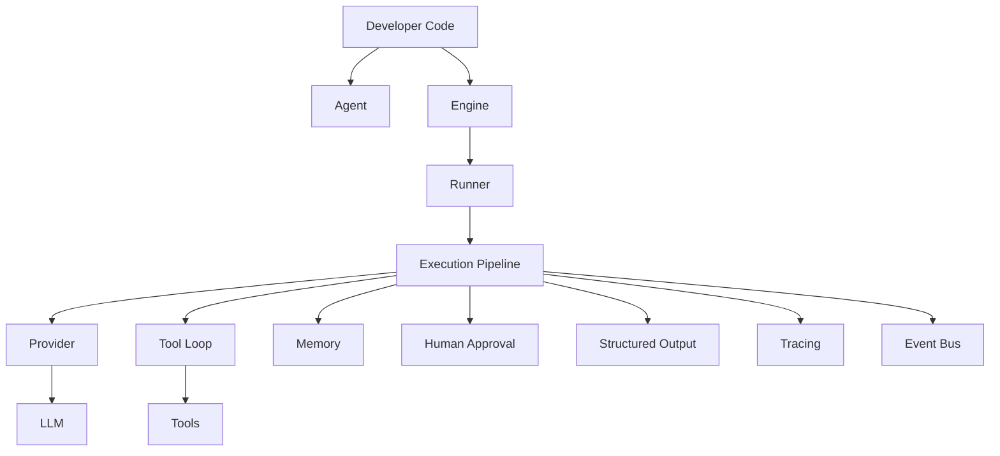
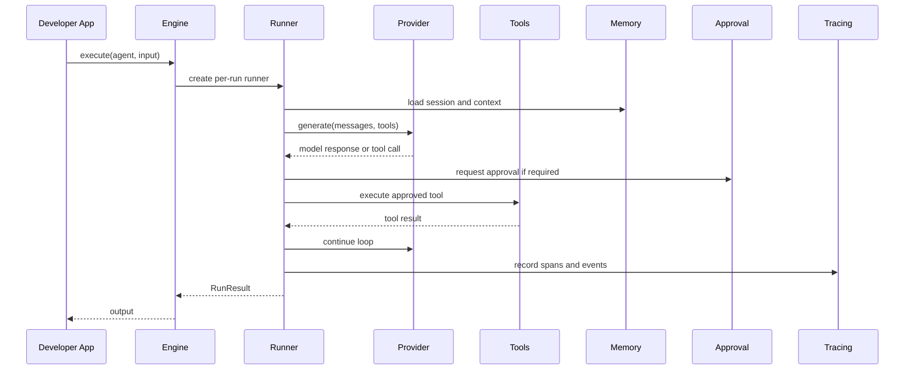

<p align="center">
  <picture>
    <source media="(prefers-color-scheme: dark)" srcset="https://placehold.co/160x160/111111/ffffff?text=Shiro" />
    
  </picture>
</p>

<h1 align="center">Shiro</h1>

<p align="center">
  <strong>Production-ready TypeScript Agent SDK.</strong>
</p>

<p align="center">
  Build multi-agent AI applications with tools, memory, sessions, approvals, tracing, structured outputs, plugins, and Studio observability.
</p>

<p align="center">
  <a href="https://www.npmjs.com/package/shiro"></a>
  <a href="https://github.com/ArchishaSahai/shiro/actions"></a>
  <a href="./LICENSE"></a>
  <a href="https://www.typescriptlang.org/"></a>
  
</p>

---

## Why Shiro?

Shiro is for TypeScript developers building real AI products: assistants, workflow agents, internal automation, copilots, research systems, support tools, and multi-agent applications that need more than a single provider call.

Provider SDKs are excellent for talking to models. They usually stop there. Production agent systems need orchestration: execution loops, tool calls, retries, sessions, memory, handoffs, human approval, structured output validation, tracing, and local debugging. Shiro exists to own that orchestration layer so application code can stay focused on instructions, tools, and business behavior.

Use provider SDKs when you need direct model access. Use Shiro when your application needs a framework around the model.

## Features

| Capability         | Status | What It Gives You                                                                           |
| ------------------ | ------ | ------------------------------------------------------------------------------------------- |
| Multi-Agent        | ✅     | Agent handoffs, agent registry, recursion safeguards, and shared run context                |
| Tools              | ✅     | Typed tools, validation, execution state, metrics, cancellation, and error mapping          |
| HITL               | ✅     | Human approval policies, approval providers, timeouts, and safe default behavior            |
| Memory             | ✅     | Memory providers, snapshots, retrieval strategies, and context preparation                  |
| Sessions           | ✅     | Session stores, conversation state, active agent tracking, and run continuity               |
| Structured Outputs | ✅     | Zod-backed schemas, validation, repair, and typed run results                               |
| Streaming          | ✅     | Provider-level streaming contracts and OpenAI streaming support                             |
| Plugins            | ✅     | Provider, tool, memory, tracing, approval, and Studio extension points                      |
| Tracing            | ✅     | Run traces, spans, events, JSON export, and console export                                  |
| Studio             | ✅     | Visual dashboard for runs, timelines, graphs, tools, memory, approvals, and metrics         |
| CLI                | ✅     | Project scaffolding, diagnostics, provider inspection, plugin inspection, and Studio launch |

## Quick Start

Install Shiro and the OpenAI provider:

```bash
pnpm add @shiro/core @shiro/openai
```

Create an agent:

```ts
import { Agent, Engine } from "@shiro/core";
import { OpenAIPlugin } from "@shiro/openai";

const engine = new Engine();

engine.use(
  new OpenAIPlugin({
    apiKey: process.env.OPENAI_API_KEY!,
    model: "gpt-5",
  })
);

const agent = new Agent({
  name: "Assistant",
  instructions: "You are a helpful AI assistant.",
  provider: "openai",
});

const result = await engine.execute(agent, "Hello!");

console.log(result.output);
```

Or scaffold a project with the CLI (`@shiro/cli` — not the unrelated npm package named `shiro`):

```bash
pnpm dlx @shiro/cli init my-agent
cd my-agent
cp .env.example .env
pnpm dev
```

Launch Studio from a Shiro project:

```bash
pnpm studio
# or
pnpm exec shiro dev
```

## Architecture

Shiro keeps the public developer API small while isolating orchestration responsibilities behind stable extension points.





<details>
<summary>Package layout</summary>

| Package                | Responsibility                                                                                    |
| ---------------------- | ------------------------------------------------------------------------------------------------- |
| `packages/core`        | Agent, Engine, Runner, tools, memory, sessions, tracing, plugins, approvals, and public contracts |
| `packages/openai`      | OpenAI plugin and provider integration                                                            |
| `packages/cli`         | `@shiro/cli` — `shiro` binary for scaffolding and Studio launch                                   |
| `packages/shared`      | Cross-package shared utilities                                                                    |
| `apps/docs`            | Documentation website                                                                             |
| `apps/studio`          | Visual run and trace dashboard                                                                    |
| `examples/basic-agent` | Minimal runnable agent example                                                                    |

</details>

## Studio

Shiro Studio is the visual companion for understanding agent execution.

| Timeline                                                                                            | Execution Graph                                                                                            |
| --------------------------------------------------------------------------------------------------- | ---------------------------------------------------------------------------------------------------------- |
|  |  |

| Memory Explorer                                                                                            | Trace Viewer                                                                                         |
| ---------------------------------------------------------------------------------------------------------- | ---------------------------------------------------------------------------------------------------- |
|  |  |

Studio helps inspect:

- Timeline: provider calls, tool calls, approvals, memory operations, output validation, and completion.
- Execution graph: manager agents, specialist agents, tools, and handoff paths.
- Memory explorer: session history, stored memories, retrieved memories, and compaction events.
- Trace viewer: spans, lifecycle events, JSON export, and console export.

Run it locally:

```bash
pnpm --filter @shiro/studio dev
```

## Examples

- [Basic Agent](./examples/basic-agent): a minimal Shiro agent using the OpenAI plugin.

More examples will be added as provider packages and deployment patterns stabilize.

## Documentation

The documentation site lives in [apps/docs](./apps/docs).

Run locally:

```bash
pnpm --filter @shiro/docs dev
```

Key docs sections:

- [Architecture](./apps/docs/content/docs/architecture.mdx)
- [Quick Start](./apps/docs/content/docs/quick-start.mdx)
- [Agents](./apps/docs/content/docs/agents.mdx)
- [Tools](./apps/docs/content/docs/tools.mdx)
- [Plugins](./apps/docs/content/docs/plugins.mdx)
- [API Reference](./apps/docs/content/docs/api-reference.mdx)

## CLI

Install the CLI as **`@shiro/cli`** (the unscoped npm package `shiro` is a different project).

| Command             | Description                                                                      |
| ------------------- | -------------------------------------------------------------------------------- |
| `shiro init [name]` | Scaffold a new Shiro project                                                     |
| `shiro dev`         | Validate configuration and launch Shiro Studio                                   |
| `shiro doctor`      | Check Node, package managers, providers, plugins, configuration, and environment |
| `shiro info`        | Print framework, project, provider, plugin, and config information               |
| `shiro providers`   | Show provider installation and configuration status                              |
| `shiro plugins`     | Show installed Shiro plugins and versions                                        |
| `shiro version`     | Print the CLI version                                                            |

```bash
pnpm dlx @shiro/cli init my-agent --yes --no-install
```

## Plugin Ecosystem

Shiro is built around plugins. Core owns orchestration contracts; concrete integrations register themselves through stable extension points.

```ts
import { Engine } from "@shiro/core";
import { OpenAIPlugin } from "@shiro/openai";

const engine = new Engine();
engine.use(
  new OpenAIPlugin({
    apiKey: process.env.OPENAI_API_KEY!,
  })
);
```

Planned (not published yet): `@shiro/anthropic`, `@shiro/gemini`, `@shiro/redis-memory`, `@shiro/postgres-sessions`, `@shiro/slack-approval`, and `@shiro/opentelemetry`.

## Roadmap

- Additional first-party provider packages: Anthropic, Gemini, Groq, Ollama, Azure OpenAI.
- Persistent memory and session adapters: Redis, SQLite, PostgreSQL, MongoDB.
- OpenTelemetry tracing integration.
- Studio live run streaming and interactive approvals.
- More examples for deployment, background jobs, webhooks, and multi-agent workflows.
- Plugin authoring guide and plugin compatibility matrix.

## Contributing

Shiro is built as a production framework, so contributions should preserve clean architecture, strict typing, and a small public surface area.

Before opening a pull request:

```bash
pnpm install
pnpm lint
pnpm typecheck
pnpm build
pnpm test
pnpm format:check
```

Good first contributions include documentation improvements, examples, diagnostics, provider tests, and small DX improvements.

## License

MIT © Shiro contributors
